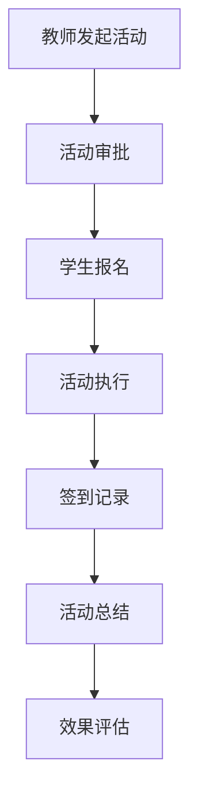

# 体育教学辅助网站技术框架设计

## 项目概述

### 系统定位
体育老师专用的综合教学辅助管理平台，以学生数据管理系统为核心基础，集成运动会编排、学生体测数据管理、体育社团活动管理、考勤管理和班级赛管理等功能模块，为体育教师提供全方位的数字化教学管理解决方案。

### 核心架构
```
┌─────────────────────────────────────────────────────────────┐
│                   核心基础层 (Core Foundation)                │
├─────────────────────────────────────────────────────────────┤
│              学生数据管理系统 (Student Data System)            │ ← 核心基础
│  ┌─────────────┐ ┌─────────────┐ ┌─────────────┐              │
│  │ 学生档案管理 │ │ 班级组织管理 │ │ 家庭信息管理 │              │
│  └─────────────┘ └─────────────┘ └─────────────┘              │
│                                                             │
│              用户权限管理系统 (Auth & Permission)              │
└─────────────────────────────────────────────────────────────┘
                                │
┌─────────────────────────────────────────────────────────────┐
│                    业务功能层 (Business Layer)               │
├─────────────────────────────────────────────────────────────┤
│ 运动会编排系统 │ 体测数据系统 │ 社团活动系统 │ 考勤系统 │ 班级赛系统 │
│   (依赖学生)   │  (依赖学生)   │  (依赖学生)   │ (依赖学生) │ (依赖学生) │
└─────────────────────────────────────────────────────────────┘
```

### 设计原则
- **数据驱动**：以学生数据为所有业务功能的基础
- **模块化设计**：各功能模块独立开发部署，便于维护升级
- **数据标准化**：遵循国家体育教育相关标准和规范
- **用户体验优先**：简化操作流程，提高工作效率
- **数据安全可靠**：确保学生隐私数据和教学数据安全
- **扩展性强**：支持未来功能扩展和系统升级

## 核心功能模块架构

### 0. 学生数据管理系统（核心基础模块）

#### 功能特性
- **学生档案管理模块**
  - 学生基本信息：学籍号、姓名、性别、出生日期、身份证号
  - 健康状况：体质情况、过敏信息、特殊情况说明
  - 体育能力评估：基础体能水平、运动特长
  - 历史记录：升学记录、转学记录

- **班级组织管理模块**
  - 班级信息：班级名称、年级、班主任、班级人数
  - 学生分班：按班级分组、跨班级学生管理
  - 班级动态：班级人数变化、班级调整记录
  - 年级管理：年级设置、学年升级

- **家庭信息管理模块**
  - 家长信息：父亲、母亲联系方式、工作单位
  - 紧急联系人：紧急联系人的姓名、电话、关系
  - 接送人员：允许接送学生的人员信息
  - 家庭住址：详细地址、交通路线

- **数据导入导出模块**
  - Excel批量导入：支持模板化批量导入学生数据
  - 第三方系统对接：与学籍系统、教务系统数据同步
  - 数据导出：支持多种格式的数据导出
  - 数据校验：导入数据完整性校验、重复数据检测

#### 核心数据结构
```sql
-- 学生基础信息表
CREATE TABLE students (
    id BIGINT PRIMARY KEY AUTO_INCREMENT,
    student_no VARCHAR(50) UNIQUE NOT NULL COMMENT '学籍号',
    real_name VARCHAR(100) NOT NULL COMMENT '姓名',
    gender ENUM('male', 'female') NOT NULL COMMENT '性别',
    birth_date DATE NOT NULL COMMENT '出生日期',
    id_card VARCHAR(18) COMMENT '身份证号',
    photo_url VARCHAR(500) COMMENT '照片地址',
    
    -- 健康状况
    health_status TEXT COMMENT '健康状况描述',
    allergy_info TEXT COMMENT '过敏信息',
    special_notes TEXT COMMENT '特殊情况说明',
    
    -- 体育能力
    sports_level ENUM('excellent', 'good', 'average', 'poor') COMMENT '体育水平',
    sports_specialty VARCHAR(200) COMMENT '运动特长',
    physical_limitations TEXT COMMENT '身体限制说明',
    
    -- 状态信息
    status ENUM('active', 'graduated', 'transferred', 'suspended') DEFAULT 'active',
    enrollment_date DATE NOT NULL COMMENT '入学日期',
    graduation_date DATE COMMENT '毕业日期',
    
    -- 时间戳
    created_at TIMESTAMP DEFAULT CURRENT_TIMESTAMP,
    updated_at TIMESTAMP DEFAULT CURRENT_TIMESTAMP ON UPDATE CURRENT_TIMESTAMP,
    
    INDEX idx_student_no (student_no),
    INDEX idx_name (real_name),
    INDEX idx_class_status (class_id, status)
);

-- 班级信息表
CREATE TABLE classes (
    id BIGINT PRIMARY KEY AUTO_INCREMENT,
    class_name VARCHAR(100) NOT NULL COMMENT '班级名称',
    grade VARCHAR(20) NOT NULL COMMENT '年级',
    grade_level INT NOT NULL COMMENT '年级级别(1-12)',
    academic_year VARCHAR(20) NOT NULL COMMENT '学年',
    
    -- 教师信息
    class_teacher_id BIGINT COMMENT '班主任ID',
    class_teacher_name VARCHAR(100) COMMENT '班主任姓名',
    
    -- 班级统计
    max_student_count INT DEFAULT 60 COMMENT '最大学生数',
    current_student_count INT DEFAULT 0 COMMENT '当前学生数',
    
    -- 状态信息
    status ENUM('active', 'graduated', 'archived') DEFAULT 'active',
    start_date DATE NOT NULL COMMENT '班级开始日期',
    end_date DATE COMMENT '班级结束日期',
    
    created_at TIMESTAMP DEFAULT CURRENT_TIMESTAMP,
    updated_at TIMESTAMP DEFAULT CURRENT_TIMESTAMP ON UPDATE CURRENT_TIMESTAMP,
    
    INDEX idx_grade_class (grade, class_name),
    INDEX idx_academic_year (academic_year)
);

-- 学生班级关联表
CREATE TABLE student_class_relations (
    id BIGINT PRIMARY KEY AUTO_INCREMENT,
    student_id BIGINT NOT NULL,
    class_id BIGINT NOT NULL,
    academic_year VARCHAR(20) NOT NULL,
    
    -- 关联状态
    status ENUM('active', 'transferred', 'graduated') DEFAULT 'active',
    join_date DATE NOT NULL COMMENT '加入班级日期',
    leave_date DATE COMMENT '离开班级日期',
    
    created_at TIMESTAMP DEFAULT CURRENT_TIMESTAMP,
    
    UNIQUE KEY uk_student_class_year (student_id, class_id, academic_year),
    INDEX idx_class_student (class_id, student_id)
);

-- 家庭信息表
CREATE TABLE family_info (
    id BIGINT PRIMARY KEY AUTO_INCREMENT,
    student_id BIGINT NOT NULL,
    
    -- 父亲信息
    father_name VARCHAR(100) COMMENT '父亲姓名',
    father_phone VARCHAR(20) COMMENT '父亲电话',
    father_work_unit VARCHAR(200) COMMENT '父亲工作单位',
    father_id_card VARCHAR(18) COMMENT '父亲身份证',
    
    -- 母亲信息
    mother_name VARCHAR(100) COMMENT '母亲姓名',
    mother_phone VARCHAR(20) COMMENT '母亲电话',
    mother_work_unit VARCHAR(200) COMMENT '母亲工作单位',
    mother_id_card VARCHAR(18) COMMENT '母亲身份证',
    
    -- 家庭住址
    address TEXT COMMENT '家庭住址',
    address_postcode VARCHAR(10) COMMENT '邮编',
    
    -- 紧急联系人
    emergency_contact_name VARCHAR(100) COMMENT '紧急联系人姓名',
    emergency_contact_phone VARCHAR(20) COMMENT '紧急联系人电话',
    emergency_contact_relation VARCHAR(50) COMMENT '紧急联系人关系',
    
    -- 接送人员
    pickup_persons JSON COMMENT '接送人员信息(JSON格式)',
    
    created_at TIMESTAMP DEFAULT CURRENT_TIMESTAMP,
    updated_at TIMESTAMP DEFAULT CURRENT_TIMESTAMP ON UPDATE CURRENT_TIMESTAMP,
    
    FOREIGN KEY (student_id) REFERENCES students(id) ON DELETE CASCADE,
    INDEX idx_student_id (student_id)
);
```

### 1. 运动会编排管理系统

#### 功能特性
- **项目设置模块**
  - 田赛项目设置（跳远、跳高、铅球、标枪、实心球等）
  - 径赛项目设置（100m、200m、400m、800m、1500m等）
  - 团体项目设置（4×100m接力、20×50m迎面接力等）
  - 自定义比赛项目配置

- **报名管理模块**
  - 学生信息导入导出
  - 项目报名状态跟踪
  - 报名资格验证（年龄、性别、班级限制）
  - 重复报名检测

- **编排算法模块**
  - 智能分组算法
  - 时间冲突检测
  - 场地资源优化配置
  - 裁判员安排优化

- **赛程管理模块**
  - 自动生成赛程表
  - 实时赛程调整
  - 检录时间提醒
  - 成绩录入界面

#### 核心算法设计
```python
# 分组编排算法示例
class CompetitionScheduling:
    def __init__(self):
        self.max_per_group = 8  # 每组最大人数
        self.min_rest_time = 30  # 最小休息时间(分钟)
    
    def schedule_events(self, events, students):
        schedule = {}
        for event in events:
            # 按性别、年级分组
            groups = self.create_balanced_groups(students, event)
            schedule[event.id] = self.optimize_timing(groups)
        return schedule
```

### 2. 学生体测数据上报管理系统

#### 功能特性
- **体测项目管理**
  - 国家标准体测项目配置
  - 学年体测计划制定
  - 测试时间安排
  - 设备校准记录

- **数据采集模块**
  - 批量数据导入
  - 手动数据录入
  - 设备数据对接
  - 数据实时校验

- **数据分析模块**
  - 个人成长曲线分析
  - 班级整体水平评估
  - 薄弱项目识别
  - 进步幅度统计

- **报告生成模块**
  - 个人体测报告
  - 班级体测分析报告
  - 校级体测统计报告
  - 数据可视化图表

#### 数据模型设计
```sql
-- 学生体测数据表
CREATE TABLE student_physical_test (
    id BIGINT PRIMARY KEY,
    student_id BIGINT,
    test_date DATE,
    test_type VARCHAR(50),
    height DECIMAL(5,2),
    weight DECIMAL(5,2),
    vital_capacity INT,
    run_50m DECIMAL(4,1),
    run_800m INT,
    run_1000m INT,
    sit_and_reach DECIMAL(4,1),
    standing_long_jump INT,
    pull_up INT,
    skip_rope INT,
    created_at TIMESTAMP,
    updated_at TIMESTAMP
);

-- 体测项目配置表
CREATE TABLE physical_test_items (
    id BIGINT PRIMARY KEY,
    item_name VARCHAR(100),
    unit VARCHAR(20),
    age_group VARCHAR(20),
    gender VARCHAR(10),
    min_score DECIMAL(5,2),
    max_score DECIMAL(5,2),
    is_required BOOLEAN
);
```

### 3. 体育社团活动管理系统

#### 功能特性
- **社团基础管理**
  - 社团信息维护
  - 社团分类管理
  - 指导教师分配
  - 社团成员管理

- **活动策划模块**
  - 活动计划制定
  - 活动审批流程
  - 场地预约管理
  - 器材需求统计

- **报名签到模块**
  - 在线报名系统
  - 二维码签到
  - 请假管理
  - 参与度统计

- **活动记录模块**
  - 活动照片上传
  - 活动总结报告
  - 效果评估分析
  - 成员反馈收集

#### 业务流程设计


### 4. 体育课考勤管理系统

#### 功能特性
- **课程管理模块**
  - 课程表导入导出
  - 班级学生管理
  - 场地器材安排
  - 天气预警提醒

- **考勤功能模块**
  - 多种考勤方式（扫码、人脸识别、手动录入）
  - 实时考勤状态显示
  - 请假申请审批
  - 考勤统计分析

- **安全监控模块**
  - 学生异常状态预警
  - 运动安全风险评估
  - 急救联系方式管理
  - 事故报告记录

- **成绩管理模块**
  - 课堂表现记录
  - 技能考核评分
  - 平时成绩统计
  - 期末成绩汇总

#### 考勤算法设计
```javascript
// 考勤统计算法
class AttendanceCalculator {
    calculateAttendanceRate(studentId, courseId, startDate, endDate) {
        const totalClasses = this.getTotalClasses(courseId, startDate, endDate);
        const attendedClasses = this.getAttendedClasses(studentId, courseId, startDate, endDate);
        const justifiedAbsences = this.getJustifiedAbsences(studentId, courseId, startDate, endDate);
        
        return (attendedClasses + justifiedAbsences) / totalClasses;
    }
    
    generateAttendanceReport(courseId, dateRange) {
        // 生成考勤报告
        const students = this.getStudentsByCourse(courseId);
        return students.map(student => ({
            studentId: student.id,
            studentName: student.name,
            attendanceRate: this.calculateAttendanceRate(student.id, courseId, dateRange.start, dateRange.end),
            absenceCount: this.getAbsenceCount(student.id, courseId, dateRange),
            lateCount: this.getLateCount(student.id, courseId, dateRange)
        }));
    }
}
```

### 5. 班级赛管理系统

#### 功能特性
- **比赛项目设置**
  - 班级间比赛项目配置
  - 比赛规则自定义
  - 评分标准设置
  - 奖励机制配置

- **报名组织模块**
  - 班级报名统计
  - 选手资格审核
  - 团队项目分组
  - 替补人员管理

- **赛程编排模块**
  - 自动赛程生成
  - 时间冲突检测
  - 场地资源分配
  - 赛程表发布

- **成绩管理模块**
  - 实时成绩录入
  - 排名自动更新
  - 奖牌榜统计
  - 成绩证书生成

## 系统整体架构设计

### 技术架构
```
┌─────────────────────────────────────────────────────────────┐
│                    前端层 (Frontend)                          │
├─────────────────────────────────────────────────────────────┤
│  Web应用 (React/Vue.js)  │  移动端 (React Native/Uni-app)      │
└─────────────────────────────────────────────────────────────┘
                                │
┌─────────────────────────────────────────────────────────────┐
│                    API网关层 (Gateway)                        │
├─────────────────────────────────────────────────────────────┤
│  路由转发  │  认证授权  │  限流控制  │  监控日志  │  负载均衡     │
└─────────────────────────────────────────────────────────────┘
                                │
┌─────────────────────────────────────────────────────────────┐
│                   微服务层 (Microservices)                    │
├─────────────────────────────────────────────────────────────┤
│ 用户服务 │ 运动会服务 │ 体测服务 │ 社团服务 │ 考勤服务 │ 班级赛服务 │
└─────────────────────────────────────────────────────────────┘
                                │
┌─────────────────────────────────────────────────────────────┐
│                   数据层 (Data Layer)                        │
├─────────────────────────────────────────────────────────────┤
│  关系数据库  │  缓存数据库  │  文件存储  │  消息队列  │  搜索引擎  │
│  (MySQL)    │   (Redis)   │ (MinIO)  │  (RabbitMQ) │ (ElasticSearch)│
└─────────────────────────────────────────────────────────────┘
```

### 核心微服务设计

#### 用户认证服务 (Auth Service)
```python
from fastapi import FastAPI, Depends, HTTPException
from fastapi.security import OAuth2PasswordBearer
from datetime import datetime, timedelta

app = FastAPI()

class AuthService:
    def __init__(self):
        self.jwt_secret = "your-secret-key"
        self.jwt_algorithm = "HS256"
        self.token_expire_minutes = 60
    
    def authenticate_user(self, username: str, password: str):
        # 用户认证逻辑
        pass
    
    def create_access_token(self, data: dict):
        # JWT令牌生成
        pass
    
    def verify_token(self, token: str = Depends(OAuth2PasswordBearer(tokenUrl="token"))):
        # 令牌验证
        pass
```

#### 运动会编排服务 (Sports Meet Service)
```python
class SportsMeetService:
    def __init__(self):
        self.scheduling_algorithm = SchedulingAlgorithm()
    
    def create_sports_meet(self, meet_data):
        # 创建运动会
        pass
    
    def generate_schedule(self, meet_id, constraints):
        # 生成赛程安排
        return self.scheduling_algorithm.schedule(meet_id, constraints)
    
    def register_student(self, student_id, event_id):
        # 学生报名
        pass
    
    def record_result(self, result_data):
        # 记录比赛成绩
        pass
```

### 数据库设计

#### 核心数据表结构
```sql
-- 用户表
CREATE TABLE users (
    id BIGINT PRIMARY KEY AUTO_INCREMENT,
    username VARCHAR(50) UNIQUE NOT NULL,
    password_hash VARCHAR(255) NOT NULL,
    real_name VARCHAR(100),
    role ENUM('admin', 'teacher', 'student', 'parent'),
    school_id BIGINT,
    created_at TIMESTAMP DEFAULT CURRENT_TIMESTAMP,
    updated_at TIMESTAMP DEFAULT CURRENT_TIMESTAMP ON UPDATE CURRENT_TIMESTAMP
);

-- 学校表
CREATE TABLE schools (
    id BIGINT PRIMARY KEY AUTO_INCREMENT,
    school_name VARCHAR(200) NOT NULL,
    school_code VARCHAR(50) UNIQUE,
    address TEXT,
    contact_info VARCHAR(200),
    created_at TIMESTAMP DEFAULT CURRENT_TIMESTAMP
);

-- 班级表
CREATE TABLE classes (
    id BIGINT PRIMARY KEY AUTO_INCREMENT,
    class_name VARCHAR(100) NOT NULL,
    grade VARCHAR(20),
    teacher_id BIGINT,
    school_id BIGINT,
    student_count INT DEFAULT 0,
    created_at TIMESTAMP DEFAULT CURRENT_TIMESTAMP
);

-- 学生表
CREATE TABLE students (
    id BIGINT PRIMARY KEY AUTO_INCREMENT,
    student_no VARCHAR(50) UNIQUE,
    real_name VARCHAR(100) NOT NULL,
    gender ENUM('male', 'female'),
    birth_date DATE,
    class_id BIGINT,
    parent_contact VARCHAR(200),
    created_at TIMESTAMP DEFAULT CURRENT_TIMESTAMP
);
```

### 安全设计

#### 数据安全措施
- **数据加密**：敏感数据采用AES-256加密存储
- **传输安全**：全站HTTPS，API接口采用JWT认证
- **权限控制**：基于RBAC的细粒度权限管理
- **数据备份**：每日自动备份，关键数据实时同步
- **隐私保护**：学生个人信息脱敏处理

#### 权限控制矩阵
```
角色\权限          查看  添加  修改  删除  导出  审批
系统管理员          ✓    ✓    ✓    ✓    ✓    ✓
体育老师            ✓    ✓    ✓    ✗    ✓    ✓
学生                ✓    ✗    ✗    ✗    ✗    ✗
家长                ✓    ✗    ✗    ✗    ✓    ✗
```

## 部署架构

### 容器化部署
```yaml
# docker-compose.yml
version: '3.8'
services:
  frontend:
    build: ./frontend
    ports:
      - "80:80"
    depends_on:
      - backend
  
  backend:
    build: ./backend
    ports:
      - "8000:8000"
    environment:
      - DATABASE_URL=mysql://user:pass@db:3306/sports_db
      - REDIS_URL=redis://redis:6379
    depends_on:
      - db
      - redis
  
  db:
    image: mysql:8.0
    environment:
      - MYSQL_ROOT_PASSWORD=rootpass
      - MYSQL_DATABASE=sports_db
    volumes:
      - mysql_data:/var/lib/mysql
  
  redis:
    image: redis:7-alpine
    
  nginx:
    image: nginx:alpine
    ports:
      - "443:443"
    volumes:
      - ./nginx.conf:/etc/nginx/nginx.conf
```

### CI/CD流水线
```yaml
# .github/workflows/deploy.yml
name: Deploy to Production
on:
  push:
    branches: [main]

jobs:
  test:
    runs-on: ubuntu-latest
    steps:
      - uses: actions/checkout@v2
      - name: Run Tests
        run: |
          npm install
          npm test
          npm run lint
  
  build:
    needs: test
    runs-on: ubuntu-latest
    steps:
      - uses: actions/checkout@v2
      - name: Build Docker Images
        run: |
          docker build -t sports-app .
          docker tag sports-app $REGISTRY/sports-app:$GITHUB_SHA
  
  deploy:
    needs: build
    runs-on: ubuntu-latest
    steps:
      - name: Deploy to Kubernetes
        run: |
          kubectl set image deployment/app app=$REGISTRY/sports-app:$GITHUB_SHA
```

## 性能优化策略

### 前端优化
- **代码分割**：按路由和功能模块分割代码
- **懒加载**：图片和组件懒加载
- **CDN加速**：静态资源CDN分发
- **缓存策略**：浏览器缓存和Service Worker缓存

### 后端优化
- **数据库优化**：索引优化、查询优化、分库分表
- **缓存策略**：Redis缓存热点数据
- **异步处理**：消息队列处理耗时任务
- **连接池**：数据库连接池优化

### 监控指标
- **应用性能监控**：响应时间、吞吐量、错误率
- **业务指标监控**：用户活跃度、功能使用率
- **基础设施监控**：服务器资源使用情况
- **用户体验监控**：页面加载时间、用户操作路径

## 开发计划

### 阶段一：核心基础开发（6-8周）
**第一优先级：学生数据管理系统（4周）**
1. 学生档案管理模块
   - 学生基本信息录入和编辑
   - 批量导入Excel数据功能
   - 学生信息搜索和筛选
   - 照片上传和管理
2. 班级组织管理模块
   - 班级信息维护
   - 学生分班和转班功能
   - 班级统计和管理
3. 家庭信息管理模块
   - 家长信息录入
   - 紧急联系人管理
   - 接送人员设置
4. 数据导入导出模块
   - Excel模板设计和数据校验
   - 第三方系统数据对接接口
   - 数据备份和恢复功能

**第二优先级：用户权限管理系统（2周）**
1. 用户认证登录系统
2. 角色权限管理（管理员、教师、学生、家长）
3. 基础UI框架搭建

**第三优先级：基础功能完善（2周）**
1. 系统配置管理
2. 数据备份恢复机制
3. 基础统计分析功能
4. 系统日志和监控

### 阶段二：业务功能开发（6-8周）
1. 体育课考勤管理系统
   - 依赖学生数据管理系统的基础数据
2. 运动会编排管理系统
   - 依赖学生基础信息和班级信息
3. 学生体测数据管理系统
   - 依赖学生基础信息和历史体测记录
4. 数据分析和报表功能
   - 基于各业务模块数据生成分析报告

### 阶段三：完善和优化（4-6周）
1. 体育社团活动管理系统
   - 依赖学生基础信息和家庭联系信息
2. 班级赛管理系统
   - 依赖学生基础信息和体育能力评估
3. 性能优化和安全加固
4. 移动端应用开发
5. 用户培训和文档编写

## 技术选型说明

### 前端技术栈
- **框架**：React 18 + TypeScript
- **UI组件库**：Ant Design / Element Plus
- **状态管理**：Redux Toolkit / Zustand
- **路由管理**：React Router v6
- **构建工具**：Vite
- **样式方案**：CSS Modules + Tailwind CSS

### 后端技术栈
- **主框架**：Python FastAPI / Node.js Express
- **数据库**：MySQL 8.0 + Redis 7.0
- **ORM**：SQLAlchemy / Prisma
- **认证授权**：JWT + OAuth2
- **API文档**：Swagger/OpenAPI
- **任务队列**：Celery / Bull

### 基础设施
- **容器化**：Docker + Docker Compose
- **编排系统**：Kubernetes（生产环境）
- **CI/CD**：GitHub Actions / GitLab CI
- **监控**：Prometheus + Grafana
- **日志**：ELK Stack
- **存储**：MinIO / 阿里云OSS

## 总结

本技术框架设计充分考虑了体育教学管理的实际需求，采用现代化的微服务架构和技术栈，确保系统的可扩展性、可维护性和用户体验。通过模块化设计，各功能模块可以独立开发和部署，降低了开发风险和成本。同时，严格的数据安全和隐私保护措施，符合教育行业的数据安全要求。

框架设计注重实用性和易用性，能够显著提升体育老师的工作效率，为学校体育教学管理提供强有力的数字化支持。